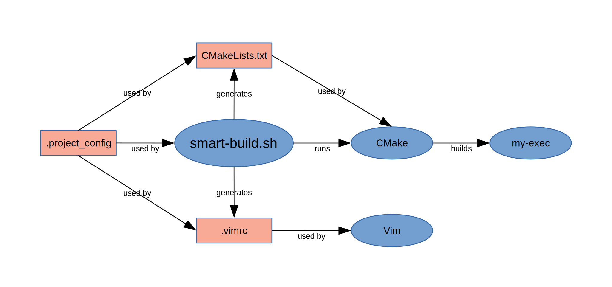

# smart-build

[](https://github.com/digimokan/smart-build/releases/latest "Latest Release Notes")
[](LICENSE.txt "Project License")
[](https://travis-ci.com/digimokan/smart-build "Build And Test Results From Master Branch")

Linux/UNIX shell script for building CMake projects and configuring vim
linting/completion.

## Table Of Contents

* [Motivation](#motivation)
* [Features](#features)
* [Design](#design)
* [Requirements](#requirements)
* [Quick Start](#quick-start)
* [Sample Project Layout](#sample-project-layout)
* [Sample Config File](#sample-config-file)
* [Full Usage / Options](#full-usage--options)
* [Examples](#examples)
* [Contributing](#contributing)

## Motivation

A basic _CMake_ project requires configuring C/C++ language type/standard,
include directories, compile options and definitions, etc. _Vim_ linting and
completion plugins require similar configuration. _smart-build_ is a shell
script that performs these tasks using one simple `.project_config` file:

* Generates a custom `CMakeLists.txt` file, which pulls from `.project_config`.
* Runs _CMake_ and makes and builds tests.
* Optionally generates a project-local `.vimrc` file, which pulls from
  `.project_config` to configure _Vim_.

## Features

* Single portable `smart-build.sh` shell script.
* Builds and tests C/C++ projects with _CMake_ with one basic command.
* Auto-configures _Vim_ linting/completion plugin settings.
* Fast project setup via one small config file.
* Easy to use, well-documented config file settings.
* Extensive command options for building, testing, and varied usage.
* Unit-tested with [shunit2](https://github.com/kward/shunit2) in multiple
  POSIX shells (_bash_, _mksh_, _dash_, _zsh_).

## Design



## Requirements

* Linux/UNIX
* A POSIX shell
* _CMake_ version 3.0.2
* Optional: _Vim_ linting plugin (currently runs with
  [ale]( https://github.com/w0rp/ale ))
* Optional: _Vim_ completion plugin (currently runs with
  [completor]( https://github.com/maralla/completor.vim ))

## Quick Start

1. Copy `smart-build.sh` into your project root directory.

    * See [Sample Project Layout](#sample-project-layout).

2. Generate `.project_config`, `CMakeLists.txt`, and `.vimrc`:

   ```bash
   $ ./smart-build -PLV
   ```

3. Configure settings in `.project_config`.

    * See [Sample Config File](#sample-config-file).

4. As required : Modify `CMakeLists.txt` and `.vimrc`.

    * NOTE: _smart-build_ will run normally without any `CMakeLists.txt` or
      `.vimrc` customizations.

5. Build project and run tests:

   ```bash
   $ ./smart-build -dt
   ```

6. Run _Vim_ with auto-configured linting/completion plugin settings (_Vim_
   must be started from project root directory):

   ```bash
   $ vim .
   ```

## Sample Project Layout

```
├─┬ my-project/
│ ├─┬ src/
│ │ ├─┬ somea/
│ │ │ ├── Hello.cpp
│ │ │ └── Hello.hpp
│ │ ├─┬ someb/
│ │ │ ├── Goodbye.cpp
│ │ │ └── Goodbye.hpp
│ │ └── main.cpp
│ ├─┬ tests/
│ │ ├─┬ unit_tests/
│ │ │ └── Goodbye_test.cpp
│ │ └── doctest_testharness.cpp
│ ├─┬ third_party/
│ │ └─┬ doctest/
│ │   └── doctest.h
│ ├── .project_config
│ ├── .vimrc
│ ├── smart-build.sh
│ └── CMakeLists.txt
```

## Sample Config File

Contents of `.project_config`:

```bash
# cmake project title
my-project
# cmake min version required
3.0.2
# language type:"C" or "CPP"
CPP
# language standard
17
# defs and system-include standards: space-separated, "-" if empty
-DGNU_SOURCE -D_LARGEFILE64_SOURCE
# warning levels: space-separated, "-" if empty
-Wall -Wno-unused
# top-level src dirs: colon-separated
src:third_party
# src file with main-executable code: "-" if none, i.e. test only
src/main.cpp
# main executable file to build: "-" if none, i.e. test only
my-exec
# testing language type: "C" or "CPP" (N/A if building without -t/-T)
CPP
# testing language standard (N/A if building without -t/-T)
17
# testing top-level src dirs: colon-separated, "-" if none
tests
# test-driver executable to build (N/A if building without -t/-T)
my-test-driver
# EOF: FILE MUST END WITH THIS LAST LINE
```

## Full Usage / Options

USAGE:

`smart-build.sh  -h`

`smart-build.sh  -c|-C  [-b <dir>]  [-p <file>]  [-e <file>]`  
&nbsp; &nbsp; &nbsp; &nbsp; &nbsp; &nbsp; &nbsp; &nbsp; &nbsp; &nbsp; &nbsp; &nbsp; &nbsp; &nbsp; &nbsp; `[-x <file>]  [-q]`

`smart-build.sh  -d|-r|-w|-m  [-c|-C]  [-g|-l]  [-t|-T]`  
&nbsp; &nbsp; &nbsp; &nbsp; &nbsp; &nbsp; &nbsp; &nbsp; &nbsp; &nbsp; &nbsp; &nbsp; &nbsp; &nbsp; &nbsp; `[-b <dir>]  [-p <file>]  [-e <file>|-E]  [-x <file>]  [-q]`

`smart-build.sh  -P  [-L]  [-V]`

`smart-build.sh  -L  [-P]  [-V]`

`smart-build.sh  -V  [-P]  [-L]`

OPTIONS:

`-h, --help`  
&nbsp; &nbsp; &nbsp; &nbsp; print this help message

`-d, --build-type-debug`  
&nbsp; &nbsp; &nbsp; &nbsp; compile and link with debug symbols

`-r, --build-type-release`  
&nbsp; &nbsp; &nbsp; &nbsp; compile and link release

`-w, --build-type-release-with-debug`  
&nbsp; &nbsp; &nbsp; &nbsp; compile and link release with debug symbols

`-m, --build-type-release-min-max`  
&nbsp; &nbsp; &nbsp; &nbsp; compile and link release for min-size, max-speed

`-c, --clean-all`  
&nbsp; &nbsp; &nbsp; &nbsp; remove built program/testing executables and build dir

`-C, --clean-executables`  
&nbsp; &nbsp; &nbsp; &nbsp; remove built program/testing executables

`-g, --use-gnu-compiler`  
&nbsp; &nbsp; &nbsp; &nbsp; use GNU gcc/g++ compiler and linker

`-l, --use-llvm-compiler`  
&nbsp; &nbsp; &nbsp; &nbsp; use LLVM clang/clang++ compiler and linker

`-t, --make-and-run-tests`  
&nbsp; &nbsp; &nbsp; &nbsp; make and run tests

`-T, --make-tests`  
&nbsp; &nbsp; &nbsp; &nbsp; make tests

`-b <dir>, --build-dir=<dir>`  
&nbsp; &nbsp; &nbsp; &nbsp; specify build dir (default is "build")

`-p <file>, --project-config-file=<file>`  
&nbsp; &nbsp; &nbsp; &nbsp; specify project config file (default is ".project_config")

`-e <file>, --executable-name=<file>`  
&nbsp; &nbsp; &nbsp; &nbsp; specify program executable to build (override config file)

`-E, --no-build-executable`  
&nbsp; &nbsp; &nbsp; &nbsp; do not build program executable (override config file)

`-x <file>, --test-driver-name=<file>`  
&nbsp; &nbsp; &nbsp; &nbsp; specify test-driver executable to build (override config file)

`-P, --generate-project-config`  
&nbsp; &nbsp; &nbsp; &nbsp; generate template .project_config file

`-L, --generate-cmakelists`  
&nbsp; &nbsp; &nbsp; &nbsp; generate template CMakeLists.txt file

`-V, --generate-vimrc`  
&nbsp; &nbsp; &nbsp; &nbsp; generate template .vimrc file

`-q, --quiet-mode`  
&nbsp; &nbsp; &nbsp; &nbsp; quiet mode

EXIT CODES:

&nbsp; &nbsp; &nbsp; &nbsp; `0` &nbsp; &nbsp; ok

&nbsp; &nbsp; &nbsp; &nbsp; `1` &nbsp; &nbsp; usage, arguments, or options error

&nbsp; &nbsp; &nbsp; &nbsp; `2` &nbsp; &nbsp; build error

&nbsp; &nbsp; &nbsp; &nbsp; `3` &nbsp; &nbsp; test error

&nbsp; &nbsp; `255` &nbsp; &nbsp; unknown error

## Examples

* Build with DEBUG, do not make tests:

   ```bash
   $ ./smart-build -d
   ```

* Build with RELEASE and make and run tests:

   ```bash
   $ ./smart-build -rt
   ```

* Build with RELEASE, make tests but do not run them:

   ```bash
   $ ./smart-build -rT
   ```

* Clean build directory and built executables:

   ```bash
   $ ./smart-build -c
   ```

* Clean build directory and built executables before building:

   ```bash
   $ ./smart-build -cd
   ```

* Build and force use of LLVM compiler (instead of system's default compiler):

   ```bash
   $ ./smart-build -dl
   ```

* Build in specified out-of-source _CMake_ build directory (default is `build`):

   ```bash
   $ ./smart-build -d -b alt_build
   ```

* Build and specify name of main executable to build (overrides `.project_config`):

   ```bash
   $ ./smart-build -d -e my-alt-exec
   ```

* Build and run tests, do not build main executable (overrides `.project_config`):

   ```bash
   $ ./smart-build -dtE
   ```

## Contributing

* Feel free to report a bug or propose a feature by opening an issue.
* Follow the project's [Contributing](CONTRIBUTING.md) guidelines.
* Respect the project's [Code Of Conduct](CODE_OF_CONDUCT.md).

